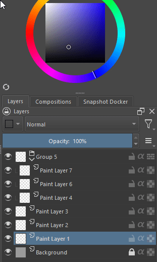

# Label Box
A plugin to add a box to choose color labels from the dockers menu, making so you dont need to right click to add a color label.  

# Installation
Download the zip from github (press the code button> download zip, or click the tags in release and download the zip from there), open krita then go to:  
Tools>scripts>import plugin from file  
Click ok and close and open krita.  

Or follow the manual installation:  

1- Copy the contents of the plugin folder into the pykrita folder in the krita resource folder (accessible through settings>manage resources>open resource folder).  
The folder label-box need to be completely moved (moving just the files inside will not work).  
2- Open krita, go to settings>configure krita> python plugin manager. Locate the Label Box and check it.  
3- Restart krita. It should appear in the layer docker.  

# How to use

Once the plugin is installed you can just choose the color label and click to apply to selected layers.

- It also works if you put your mouse on top of the box and scroll.
- It works for one or multiple layers

Now one thing that people will notice:

> **the color box will always stay in the last chosen color**, even if you select a layer that already has a color label, the box will not be updated.

**Why doesnt the box update?**  
I just couldnt find a way to check if the current layer was changed, the signal of layer changed doesnt seem to be avaliable from the krita api so i can't really do much.

